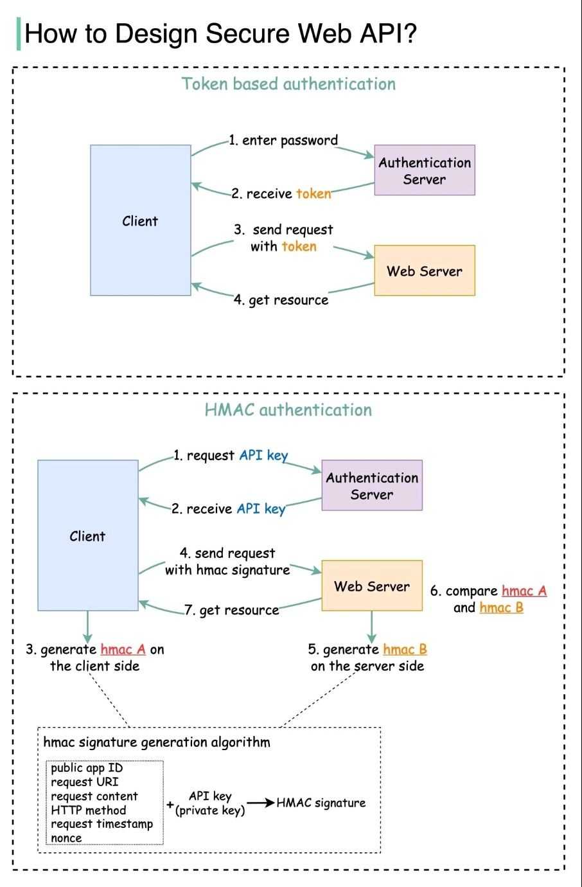
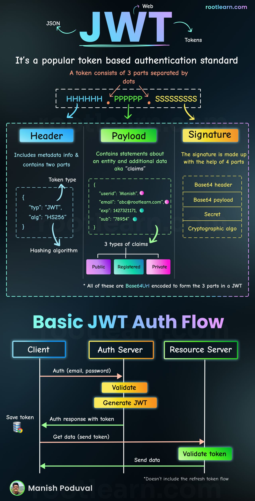

# App

#### Notes found on master :- https://github.com/fadilxcoder/symfony-client-server-api/tree/master

- App can be run without enabling containers - using in-built (Apache / MySQL)
- http://api.symfony.car-rental.local/ - **App API Swagger GUI**
- http://127.0.0.1:1080/ - **Mailcatcher**

# Architecture / Configs

- Nginx*
- PostgreSQL* (not present in below output)
- Redis
- Elasticsearch
- Mailcatcher
- PHP*

# Notes

**Containers**

```bash
CONTAINER ID   IMAGE                                                  COMMAND                  CREATED              STATUS              PORTS                                            NAMES
6aaa00249c18   redis:alpine                                           "docker-entrypoint.s…"   6 days ago           Up About a minute   0.0.0.0:6959->6379/tcp                           cra_redis
5abb7268f94c   dockage/mailcatcher:0.8.2                              "entrypoint mailcatc…"   6 days ago           Up About a minute   0.0.0.0:1025->1025/tcp, 0.0.0.0:1080->1080/tcp   cra_mailcatcher
a1a7bb6b2a00   postgres:15-alpine                                     "docker-entrypoint.s…"   6 days ago           Up About a minute   0.0.0.0:5454->5432/tcp                           cra_database
7f78ba8be65f   docker.elastic.co/elasticsearch/elasticsearch:7.11.0   "/bin/tini -- /usr/l…"   6 days ago           Up About a minute   0.0.0.0:9292->9200/tcp, 0.0.0.0:9393->9300/tcp   cra_elasticsearch
```
**Unused containers*

```
(x) 393abaeebeed   car-rental-api-symfony_nginx                           "/docker-entrypoint.…"   About a minute ago   Up About a minute   0.0.0.0:8088->80/tcp, 0.0.0.0:8084->443/tcp      cra_nginx
(x) ab1b91ecb423   car-rental-api-symfony_php-fpm                         "docker-php-entrypoi…"   About a minute ago   Up About a minute   9000/tcp                                         cra_php_fpm
```

- Install : `composer create-project symfony/skeleton:"6.2.*"`
- Profiler : `composer require --dev symfony/profiler-pack`
- Connect to project CLI : (linux) `docker exec -it cra_php_fpm ash` / (windows) : `winpty docker exec -it cra_php_fpm ash`
- Connect to `cra_php_fpm` and run ` chown -R www-data:www-data ./` due to cache issues + Force remove cache : `rm -rf ./var/cache/dev && rm -rf ./var/cache/de\~/` **OR** `rm -rf ./var/cache/*`
- Generate token : `php bin/console generate-client-token`
- Tests : `newman run car-rental-api.postman_collection.json`


# Addons.
<hr>

<hr>

