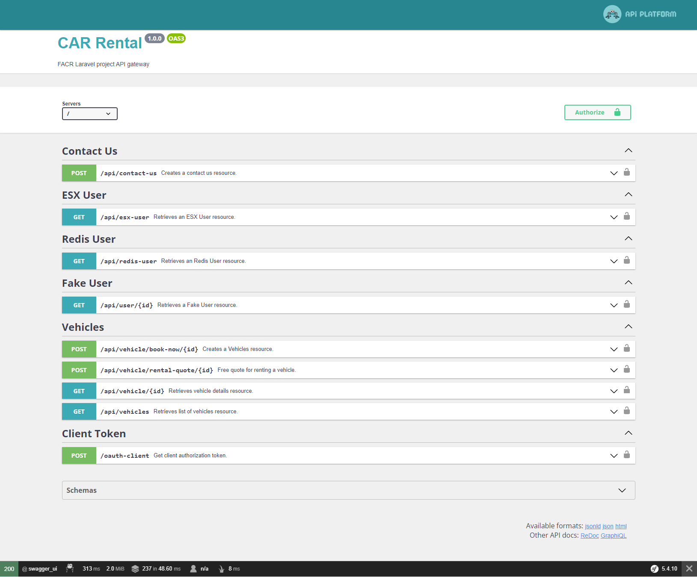

# Notes



- URL : http://api.symfony.car-rental.local/ AND http://api.symfony.car-rental.local/api
- Install debugging tools - `composer req symfony/web-profiler-bundle` and `composer require profiler --dev`
- Apache Pack : `composer require symfony/apache-pack`
- Maker bundle : `composer require symfony/maker-bundle --dev`
- HTTP Client - `composer require symfony/http-client`
- Configure swagger UI routes in `config/routes.yaml` and `config/routes/api_platform.yaml`
- Name conversion (CamelCase to snake_case) configs below
```
# api/config/services.yaml
services:
    'Symfony\Component\Serializer\NameConverter\CamelCaseToSnakeCaseNameConverter': ~
# api/config/packages/api_platform.yaml
api_platform:
    name_converter: 'Symfony\Component\Serializer\NameConverter\CamelCaseToSnakeCaseNameConverter'
```

# Docs

- https://github.com/teohhanhui/api-platform-docs/blob/master/core/swagger.md **OpenAPI Specification Support (formerly Swagger)**
- https://api-platform.com/docs/core/configuration/ **API Platform Configuration**

# Addons

### Reverse engineering entities

- Regenerate **Entity** from an existing database by :
- https://symfony.com/doc/current/doctrine/reverse_engineering.html (How to Generate Entities from an Existing Database)
- - `php bin/console doctrine:mapping:import "App\Entity" annotation --path=src/Entity` - asks Doctrine to introspect the database and generate new PHP classes with annotation metadata into `src/Entity`.
- - `php bin/console make:entity --regenerate App` - generates getter/setter methods for all Entities 

### Using JWT for authentication

- Install `composer require lexik/jwt-authentication-bundle`
- Use *cygwin*
- - `mkdir -p config/jwt`
- - `openssl genpkey -out config/jwt/private.pem -aes256 -algorithm rsa -pkeyopt rsa_keygen_bits:4096`
- - `openssl pkey -in config/jwt/private.pem -out config/jwt/public.pem -pubout`